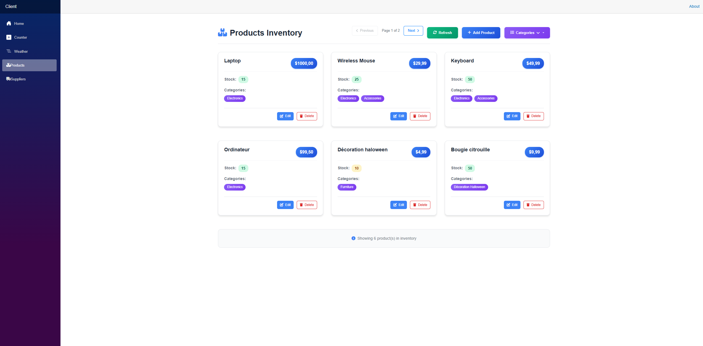
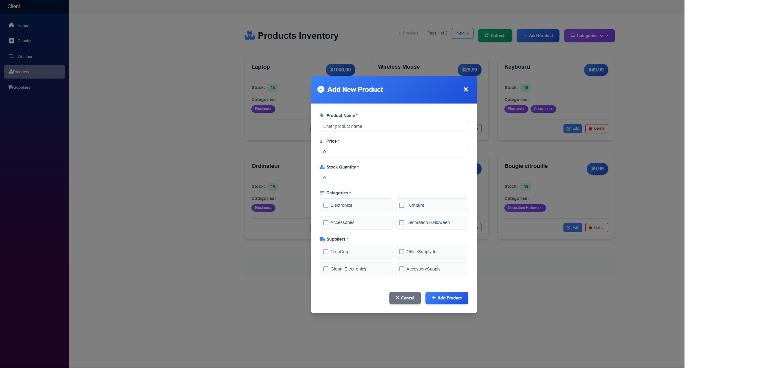
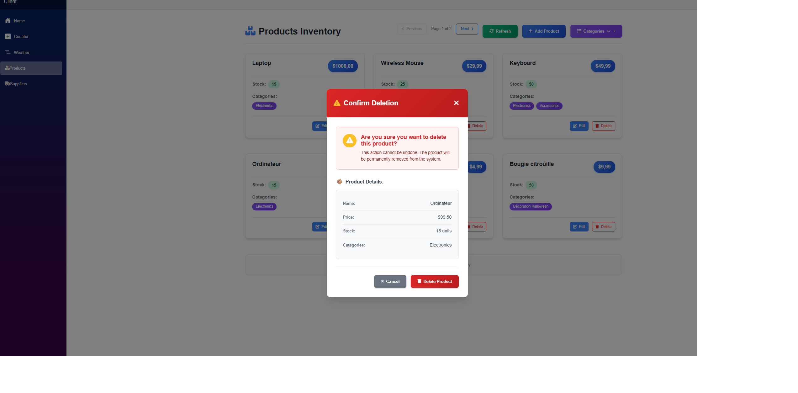
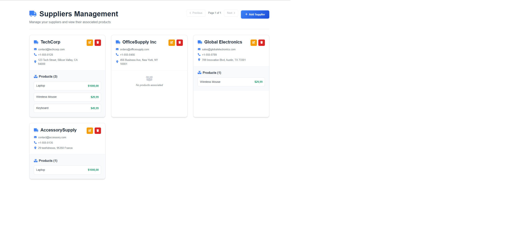

# 📦 InventoryHubApp

A modern, full-stack inventory management application built with **.NET 9**, **Blazor WebAssembly**, and **Entity Framework Core**. Manage your products, categories, and suppliers efficiently with a beautiful, responsive user interface.


## ✨ Features

### 🛍️ Product Management
- **Complete CRUD Operations**: Create, read, update, and delete products
- **Category Association**: Organize products into multiple categories
- **Supplier Linking**: Associate products with suppliers
- **Stock Tracking**: Monitor inventory levels with visual indicators
- **Low Stock Alerts**: Identify products that need restocking
- **Pagination**: Efficient data loading with configurable page sizes

### 👥 Supplier Management
- **Supplier Profiles**: Manage supplier contact information
- **Product Relationships**: View products associated with each supplier
- **Search & Filter**: Find suppliers by name or email
- **Contact Details**: Store email, phone, and address information

### 🏷️ Category Management
- **Flexible Categorization**: Organize products into categories
- **Multi-Category Support**: Products can belong to multiple categories
- **Category-Based Filtering**: Filter products by category

### ⚡ Performance & Optimization
- **Memory Caching**: Intelligent caching for frequently accessed data
- **Efficient Queries**: Optimized database queries with Entity Framework Core
- **Pagination Support**: Server-side pagination for large datasets
- **Async Operations**: Non-blocking API calls throughout the application

## 🛠️ Tech Stack

### Backend
- **.NET 9.0** - Latest .NET framework
- **ASP.NET Core Web API** - RESTful API endpoints
- **Entity Framework Core 9.0** - ORM for database operations
- **SQLite** - Lightweight, file-based database
- **Memory Caching** - Performance optimization

### Frontend
- **Blazor WebAssembly** - Interactive web UI
- **Bootstrap** - Responsive styling
- **Razor Components** - Component-based architecture

### Architecture
- **Clean Architecture** - Separation of concerns
- **Dependency Injection** - Loose coupling
- **Service Layer Pattern** - Business logic abstraction
- **Repository Pattern** - Data access abstraction

## 📸 Screenshots

### Products Inventory Page

*Browse and manage your product inventory with an intuitive card-based interface*

### Adding a New Product

*Easy-to-use modal form for adding new products with category and supplier selection*

### Product Deletion Confirmation

*Safe deletion with confirmation dialog showing product details*

### Suppliers Management

*Comprehensive supplier management with associated products display*

## 🚀 Getting Started

### Prerequisites
- [.NET 9.0 SDK](https://dotnet.microsoft.com/download/dotnet/9.0)
- A code editor (Visual Studio 2022, VS Code, or Rider)

### Installation

1. **Clone the repository**
   ```bash
   git clone https://github.com/yourusername/InventoryHubApp.git
   cd InventoryHubApp
   ```

2. **Restore dependencies**
   ```bash
   dotnet restore
   ```

3. **Build the solution**
   ```bash
   dotnet build
   ```

4. **Run the application**
   
   **Option 1: Run both projects simultaneously**
   ```bash
   dotnet run --project Server
   dotnet run --project Client
   ```
   
   **Option 2: Use Visual Studio**
   - Open `InventoryHubApp.sln`
   - Set both `Server` and `Client` as startup projects
   - Press F5 to run

5. **Access the application**
   - Client: `http://localhost:5138`
   - API: `http://localhost:5167`
   - API Documentation: `http://localhost:5167/openapi/v1.json` (Development only)

### Database Setup

The database is automatically created and seeded on first run. The SQLite database file (`inventory.db`) will be created in the `Server` directory.

## 📁 Project Structure

```
InventoryHubApp/
├── Client/                 # Blazor WebAssembly frontend
│   ├── Components/        # Reusable UI components
│   ├── Pages/             # Application pages
│   ├── Services/          # API service layer
│   └── wwwroot/           # Static files
├── Server/                # ASP.NET Core Web API
│   ├── Controllers/       # API controllers
│   ├── Database/          # DbContext and configurations
│   ├── Services/          # Business logic services
│   └── Migrations/        # EF Core migrations
└── Shared/                # Shared models and DTOs
    └── Models/            # Entity models
```

## 🔌 API Endpoints

### Products
- `GET /api/product` - Get all products
- `GET /api/product/{id}` - Get product by ID
- `POST /api/product` - Create new product
- `PUT /api/product/{id}` - Update product
- `DELETE /api/product/{id}` - Delete product
- `GET /api/product/paginated` - Get paginated products
- `GET /api/product/category/{categoryId}` - Get products by category
- `GET /api/product/supplier/{supplierId}` - Get products by supplier
- `GET /api/product/low-stock` - Get low stock products

### Suppliers
- `GET /api/supplier` - Get all suppliers
- `GET /api/supplier/{id}` - Get supplier by ID
- `POST /api/supplier` - Create new supplier
- `PUT /api/supplier/{id}` - Update supplier
- `DELETE /api/supplier/{id}` - Delete supplier
- `GET /api/supplier/paginated` - Get paginated suppliers
- `GET /api/supplier/search?name={name}` - Search suppliers by name
- `GET /api/supplier/by-email?email={email}` - Get suppliers by email

### Categories
- `GET /api/category` - Get all categories
- `GET /api/category/{id}` - Get category by ID
- `POST /api/category` - Create new category
- `PUT /api/category/{id}` - Update category
- `DELETE /api/category/{id}` - Delete category

## 🎯 Key Features Explained

### Memory Caching
The application implements intelligent caching for frequently accessed data:
- First page of products/suppliers is cached for 30 minutes
- Cache is automatically invalidated on create/update/delete operations
- Reduces database load and improves response times

### Pagination
Server-side pagination ensures efficient data loading:
- Configurable page size (default: 6 items per page)
- Metadata includes total count, current page, and navigation flags
- Optimized database queries using `Skip()` and `Take()`

### Many-to-Many Relationships
- Products can belong to multiple categories
- Products can be associated with multiple suppliers
- Relationships are managed through junction tables

## 📝 License

This project is licensed under the MIT License - see the LICENSE file for details.

## 👨‍💻 Author

Arnaud TECHER
mail : techer.arnaud@outlook.fr

---

**Note**: This is a learning project demonstrating modern .NET development practices, clean architecture, and full-stack development with Blazor WebAssembly.

